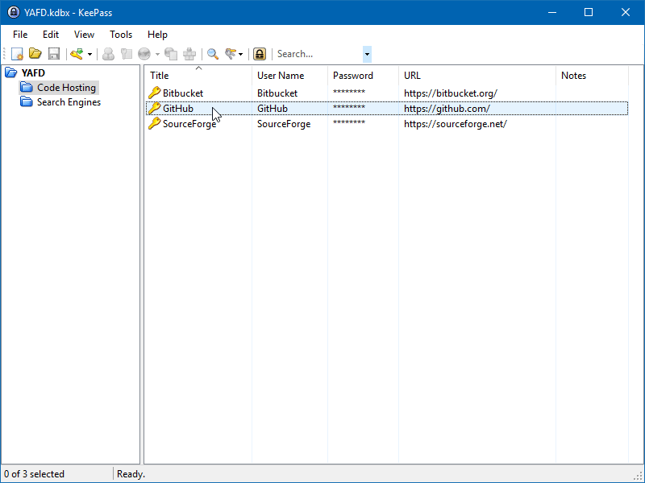
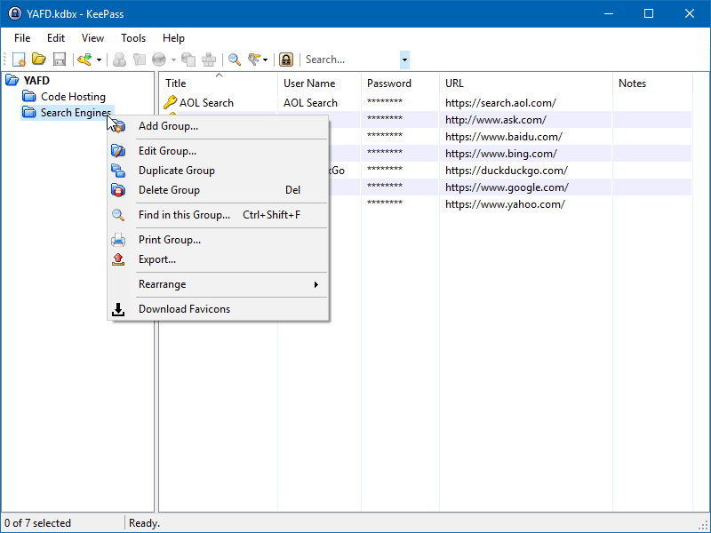

# Yet Another Favicon Downloader

[](https://github.com/navossoc/KeePass-Yet-Another-Favicon-Downloader/releases/latest)
[](/LICENSE)

## Table of contents

- [Overview](#overview)
  - [Features](#features)
- [Requirements](#requirements)
- [Installation](#installation)
- [Usage](#usage)
- [Changelog](#changelog)
- [Contributing](#contributing)
- [Copyright and license](#copyright-and-license)

## Overview

_Yet Another Favicon Downloader_ (_YAFD_ for short) is a plugin for _KeePass_ 2.x that allows you to quickly download favicons for your password entries.

### Features

- Concurrent and responsive (allows faster downloads without freezing the user interface)
- Lightweight and reliable (designed to download thousands of icons in batch)
- Smart and efficient
  - Avoids duplicate icons (reuses custom icons already present in the database)
  - Download entries without a URL scheme (automatically prefix URLs with `http://`)
  - Download entries without a URL field (automatically uses Title field)
  - - Automatically resize icons (scales down to 128x128 px)
- Linux support (_experimental_)
- Proxy support (respects _KeePass_ settings)
- Modern support (supports TLS up to 1.3 on .NET 4.8)  

## Requirements

- _KeePass_ 2.34 or higher.

### Linux

- _Mono_ 4.8.0 or newer.

Additional installation instructions can be found on the [wiki](https://github.com/navossoc/KeePass-Yet-Another-Favicon-Downloader/wiki/Linux-install).

### Windows

- _.NET Framework_ 4.5 or newer.

## Installation

- Download the [latest](https://github.com/navossoc/KeePass-Yet-Another-Favicon-Downloader/releases/latest) release.
- Copy _YetAnotherFaviconDownloader.plgx_ into _KeePass_ plugins folder.
- Restart _KeePass_ in order to load the plugin.

Or install via [Chocolatey](https://community.chocolatey.org/packages/keepass-yet-another-favicon-downloader):

```
choco install keepass-yet-another-favicon-downloader
```

To upgrade KeePass Plugin Yet Another Favicon Downloader to the latest release version for enjoying the newest features, run the following command from the command line or from PowerShell:

```
choco upgrade keepass-yet-another-favicon-downloader
```

## Usage

This plugin adds a new menu item called **"Download Favicons"** into the entry and group context menus of _KeePass_.

Select one or more entries and click _Download Favicons_ to download the _favicon_ associated with that _URL_.



---

You can also select one group and click _Download Favicons_ to download _favicons_ for all entries in this group and its subgroups.



## Changelog

See the [Releases section](https://github.com/navossoc/KeePass-Yet-Another-Favicon-Downloader/releases) for more details of each release.

## Contributing

Have a bug or a feature request? Please first search for [open and closed issues](https://github.com/navossoc/KeePass-Yet-Another-Favicon-Downloader/issues?q=is%3Aissue). If your problem or idea is not addressed yet, [please open a new issue](https://github.com/navossoc/KeePass-Yet-Another-Favicon-Downloader/issues/new).

## Copyright and license

_Yet Another Favicon Downloader_ source code is licensed under the [MIT License](LICENSE).

[Documentation](docs/README.md) is licensed under a [Creative Commons Attribution-ShareAlike 4.0 International License](http://creativecommons.org/licenses/by-sa/4.0/).

Other [Resources](Resources/README.md) are separately licensed.

When you contribute to this repository you are doing so under the above licenses.
